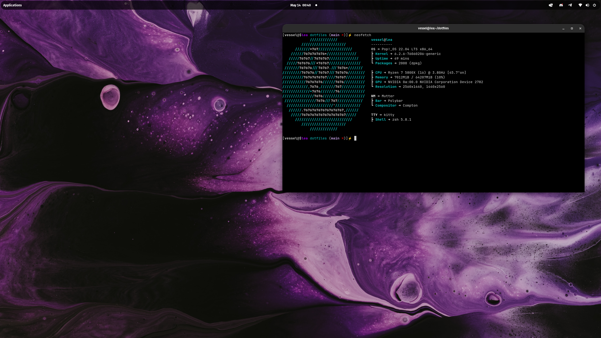

<div align="center">

</div>

<div align="center">
  <p></p>
  <p><b><i> ~ Minimalistic Dotfiles ~ </i></b></p>
  
  
  
  
</div>


|  |  |
| --- | --- |

### ***Table of Contents***

- **[Table of Contents](#table-of-contents)**
    <!-- - **[Screenshots](#screenshots)** -->
    - **[Environment](#environment)**
    - **[Dependencies](#dependencies)**
    - **[Pop OS Extra Bootloader Configuration](#pop-os-extras)**

<!-- ### ***Screenshots*** <details>
<summary><b>Nord</b></summary>

|  |  |
| --- | --- |
|  |  |

</details>

<details> -->

### ***Environment***

- **Distro**: Linux Mint/Pop!_OS
- **Compositor**: Compton
- **Terminal**: Kitty
- **Editor**: NeoVim
- **Browser**: Firefox / Brave
- **Shell**: Zsh
- **App Laucher**: Rofi
- **Font**: JetBrainsMonoNFM

### ***Dependencies***

- stow
- g++
- nvim 0.7.0+
- oh-my-zsh
- rofi

```
apt install stow
apt install g++
```

Latest version of nvim can be downloaded from its git repo page.
Synaptic package manager tends to have an outdated version that won't work with my plugins.

Make sure to install oh-my-zsh from official site.


### ***Installation***
1. Clone this directory to your home directory.

2. Run the makefile command to symbolically link all of the configurations to this repository.

### Example

```
cd ~

cd dotfiles/

make all
```

### ***Pop OS Extra Bootloader Configuration***
Since PopOS uses systemd-boot, these instructions are for adding the Windows Boot Manager entry into the systemd-boot record. This will allow us to boot into windows and will also show the boot menu.
1. ```sudo apt install os-prober```
2. ```sudo os-prober```. The output is ```/dev/sdb1@/efi/Microsoft/Boot/bootmgfw.efi:Windows Boot Manager:Windows:efi```
3. ```sudo mount /dev/sdb1 /mnt``` (you can find your drive in the first part of the os-prober's output)
4. ```sudo cp -ax /mnt/EFI/Microsoft /boot/efi/EFI``` (you can find the folder after the word ```efi``` in os-prober's output. It's always ```Microsoft``` but you need capital ```EFI``` when copying.
5. Add this line ```timeout 10``` at the end of ```sudo vim /boot/efi/loader/loader.conf```
6. Reboot.

<div align="center"></div>
