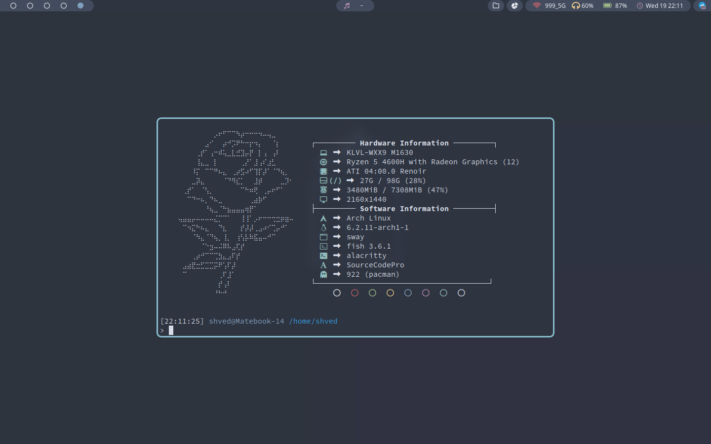

<div align="center">

</div>

<div align="center">
  <p></p>
  <p><b><i> ~ Minimalistic Dotfiles ~ </i></b></p>
  
  
  
  
</div>


|  |  |
| --- | --- |


### ***Table of Contents***

- **[Table of Contents](#table-of-contents)**
    - **[Screenshots](#screenshots)**
    - **[Environment](#environment)**
    - **[Themes](#theme-change-script)**
    - **[Dependencies](#dependencies)**

<!-- ### ***Screenshots*** <details>
<summary><b>Nord</b></summary>

|  |  |
| --- | --- |
|  |  |

</details>

<details>
<summary><b>Rose Pine</b></summary>

|  |  |
| --- | --- |
|  |  |

</details>

<details>
<summary><b>Gruvbox Dark</b></summary>

|  |  |
| --- | --- |
|  |  |

</details>

<details>
<summary><b>Dracula</b></summary>

|  |  |
| --- | --- |
|  |  |

</details>

<details>
<summary><b>Kanagawa</b></summary>

|  |  |
| --- | --- |
|  |  |

</details> -->

### ***Environment***

- **Distro**: Linux Mint
- **Compositor**: Sway
- **Notifications**: 
- **Wallpapers**: 
- **Terminal**: Kitty
- **File Manager**: 
- **Editor**: NeoVim
- **Browser**: Firefox / Brave
- **Shell**: Zsh
- **Media Player**: 
- **App Laucher**: Rofi
- **Font**: 


<details><summary><b>Video</b></summary>

https://user-images.githubusercontent.com/84767665/233387508-3736f857-6653-4071-8576-a6ee342c9a37.mov

</details>

### ***Dependencies***

- stow
- g++
- nvim 0.7.0+
- oh-my-zsh

```
apt install stow
apt install g++
```

Latest version of nvim can be downloaded from its git repo page.
Synaptic package manager tends to have an outdated version that won't work with my plugins.

Make sure to install oh-my-zsh from official site.


### ***Installation***
1. Clone this directory to your home directory.

2. Run the makefile command to symbolically link all of the configurations to this repository.

### Example

```
cd ~

cd dotfiles/

make all
```

<div align="center"></div>
