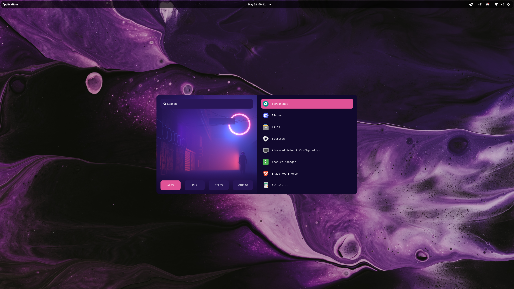

<div align="center">

</div>

<div align="center">
  <p></p>
  <p><b><i> ~ Minimalistic Dotfiles ~ </i></b></p>
  
  
  
  
</div>


|  |  |
| --- | --- |

### ***Table of Contents***

- **[Table of Contents](#table-of-contents)**
    <!-- - **[Screenshots](#screenshots)** -->
    - **[Environment](#environment)**
    - **[Dependencies](#dependencies)**

<!-- ### ***Screenshots*** <details>
<summary><b>Nord</b></summary>

|  |  |
| --- | --- |
|  |  |

</details>

<details> -->

### ***Environment***

- **Distro**: Mac OS 11 / Linux Mint
- **Terminal**: Terminator/iTerm 2
- **Editor**: NeoVim
- **Browser**: Firefox
- **Shell**: Zsh
- **App Laucher**: Rofi/Finder
- **Font**: JetBrainsMonoNFM

### ***Installation***
1. Clone this directory to your home directory.

2. Run the makefile command to symbolically link all of the configurations to this repository.

Dependencies are listed within the `dependencies/` directory.

### Example

```bash
cd ~

cd dotfiles/

make install-deps-* # rhel, mac, or deb
make all
```